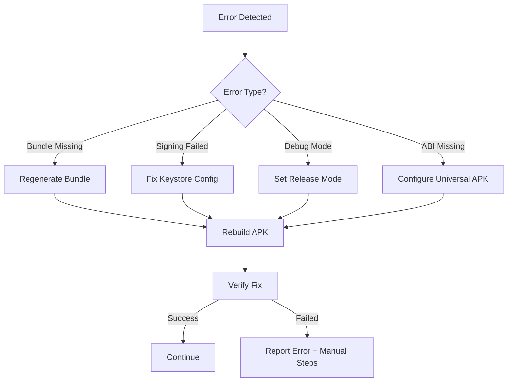

# 🔧 Automatic Error Handling Procedures

## H — IDE AI Error Correction Protocols

### 1. Bundle Missing Error
**Trigger**: `unzip -l APK | grep assets/index.android.bundle` returns `BUNDLE_MISSING`

**Automatic Actions**:
```bash
# Re-generate JS bundle
npx react-native bundle \
  --platform android \
  --dev false \
  --entry-file index.js \
  --bundle-output android/app/src/main/assets/index.android.bundle \
  --assets-dest android/app/src/main/res/

# Rebuild APK
cd android && ./gradlew clean && ./gradlew assembleRelease
```

**Report**: Bundle regeneration status and new APK verification results

### 2. APK Signer Failure
**Trigger**: `apksigner verify` returns `APKSIGNER_FAIL`

**Automatic Actions**:
1. Verify keystore.properties exists and contains valid values
2. Check android/app/build.gradle signingConfigs block
3. Validate keystore file path and credentials

**Auto-fix snippet**:
```gradle
// Ensure proper keystore loading in build.gradle
def keystorePropertiesFile = rootProject.file("keystore.properties")
def keystoreProperties = new Properties()
if (keystorePropertiesFile.exists()) {
    keystoreProperties.load(new FileInputStream(keystorePropertiesFile))
}

signingConfigs {
    release {
        storeFile rootProject.file(keystoreProperties['STORE_FILE'] ?: 'ocr-release-key.keystore')
        storePassword keystoreProperties['STORE_PASSWORD'] ?: System.getenv("RELEASE_STORE_PASSWORD")
        keyAlias keystoreProperties['KEY_ALIAS'] ?: 'ocr-key-alias'
        keyPassword keystoreProperties['KEY_PASSWORD'] ?: System.getenv("RELEASE_KEY_PASSWORD")
    }
}
```

### 3. Manifest Debuggable=True Error
**Trigger**: Manifest contains `debuggable=true`

**Automatic Actions**:
```gradle
// Fix in android/app/build.gradle
buildTypes {
    release {
        debuggable false  // Explicitly set to false
        minifyEnabled true
        shrinkResources true
        signingConfig signingConfigs.release
        proguardFiles getDefaultProguardFile('proguard-android.txt'), 'proguard-rules.pro'
    }
}
```

**Rebuild**: `./gradlew clean && ./gradlew assembleRelease`

### 4. Missing ABI/Architecture Error
**Trigger**: Native libraries missing for required architectures

**Automatic Actions**:
```gradle
// Add to android/app/build.gradle
android {
    splits {
        abi {
            enable true
            reset()
            include 'armeabi-v7a', 'arm64-v8a', 'x86', 'x86_64'
            universalApk true  // Ensures universal APK generation
        }
    }
    
    // Alternative: NDK filter approach
    defaultConfig {
        ndk {
            abiFilters 'armeabi-v7a', 'arm64-v8a', 'x86', 'x86_64'
        }
    }
}
```

### 5. Device Connection Issues
**Trigger**: `adb devices` shows no connected devices

**Automatic Actions**:
1. Restart ADB daemon: `adb kill-server && adb start-server`
2. Check USB debugging status
3. Provide emulator startup commands if available

### 6. Runtime Bundle Loading Errors
**Trigger**: Logcat shows `Unable to load script from assets`

**Automatic Actions**:
1. Verify bundle exists in APK assets
2. Check file permissions and bundle integrity
3. Re-generate bundle with verbose logging
4. Validate bundle syntax and Metro configuration

## Error Recovery Workflow



## Success Criteria Validation

After each auto-fix:
1. ✅ Bundle exists: `assets/index.android.bundle` present
2. ✅ Signature valid: `jar verified`
3. ✅ Release mode: No debuggable flags
4. ✅ Universal support: All ABI libraries included
5. ✅ Installation ready: APK installable via ADB
