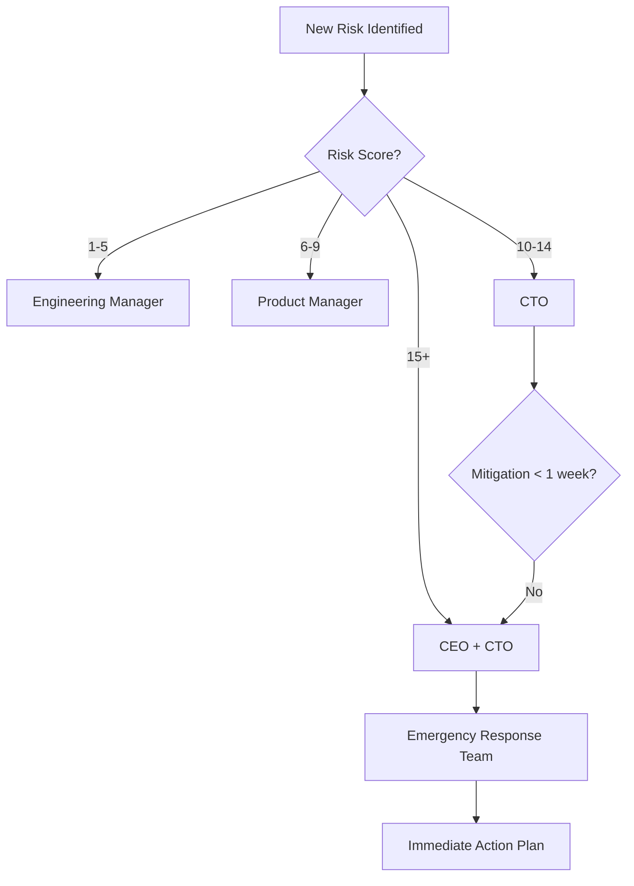

# SDK Risk Matrix ve Risk Yönetimi

**Versiyon:** 1.0  
**Tarih:** 2025-10-16

---

## 📊 Risk Skoru Hesaplama

**Risk Skoru = Etki × Olasılık**

| Seviye | Etki | Olasılık | Risk Skoru |
|--------|------|----------|------------|
| **Çok Düşük** | 1 | 1 | 1-4 |
| **Düşük** | 2 | 2 | 5-9 |
| **Orta** | 3 | 3 | 10-14 |
| **Yüksek** | 4 | 4 | 15-19 |
| **Kritik** | 5 | 5 | 20-25 |

---

## 1. RİSK MATRİXİ TABLOSU

| Risk ID | Risk Tanımı | Kategori | Etki | Olasılık | Skor | Öncelik | Mitigation |
|---------|-------------|----------|------|----------|------|---------|------------|
| **R-001** | PII veri sızıntısı (bridge) | Güvenlik | 5 | 4 | **20** | 🔴 | Native işleme, token kullanımı |
| **R-002** | NFC chip signature doğrulaması eksik | Güvenlik | 5 | 3 | **15** | 🔴 | Backend SOD verification |
| **R-003** | Deepfake ile liveness bypass | Güvenlik | 5 | 3 | **15** | 🔴 | ML-based detection |
| **R-004** | Memory leak (OCR) | Performans | 4 | 4 | **16** | 🔴 | Native frame processing |
| **R-005** | KVKK/GDPR ihlali | Uyumluluk | 5 | 3 | **15** | 🔴 | Consent flow, data retention |
| **R-006** | iOS App Store red | İş | 4 | 3 | **12** | 🟠 | Info.plist düzeltmeleri |
| **R-007** | Certificate pinning eksikliği | Güvenlik | 4 | 3 | **12** | 🟠 | TLS pinning implement |
| **R-008** | Root/jailbreak detection yok | Güvenlik | 3 | 4 | **12** | 🟠 | Detection library ekle |
| **R-009** | OCR confidence threshold eksik | Kalite | 4 | 4 | **16** | 🔴 | Threshold +retry ekle |
| **R-010** | NFC timeout handling zayıf | UX | 3 | 4 | **12** | 🟠 | Retry + UX feedback |
| **R-011** | Bridge race condition | Stabilite | 4 | 3 | **12** | 🟠 | Thread-safe locks |
| **R-012** | PII in crash logs | Güvenlik | 4 | 3 | **12** | 🟠 | Log sanitization |
| **R-013** | API response manipulation | Güvenlik | 4 | 2 | **8** | 🟡 | Response validation |
| **R-014** | Expo uyumsuzluğu | Entegrasyon | 3 | 3 | **9** | 🟡 | Dokümantasyon |
| **R-015** | Third-party dependency vulnerability | Güvenlik | 3 | 3 | **9** | 🟡 | Auto-update, audit |
| **R-016** | Low battery during liveness | UX | 2 | 4 | **8** | 🟡 | Battery check + warning |
| **R-017** | Network connectivity loss | UX | 3 | 3 | **9** | 🟡 | Offline handling |
| **R-018** | Eski cihaz performans | Performans | 3 | 3 | **9** | 🟡 | Min spec tanımla |
| **R-019** | Regülasyon değişikliği | İş | 4 | 2 | **8** | 🟡 | Monitoring, legal review |
| **R-020** | Breaking change (RN update) | Teknik | 3 | 2 | **6** | 🟢 | Version locking |

---

## 2. DETAYLI RİSK ANALİZİ

### 🔴 R-001: PII Veri Sızıntısı

**Açıklama:**  
React Native bridge üzerinden aktarılan kimlik bilgileri JavaScript heap'te kalıyor.

**Etki (5/5):**
- KVKK/GDPR ihlali → Yasal yaptırım (cezalar)
- Kullanıcı güveni kaybı
- Marka itibarı hasarı
- Medya skandalı riski

**Olasılık (4/5):**
- Mevcut implementasyonda açıkça var
- Memory profiler ile kolayca tespit edilebilir
- Rooted/jailbroken cihazlarda yüksek risk

**Mevcut Kontroller:**
- ❌ Yok

**Önerilen Mitigations:**
1. Native tarafta PII işleme (5 gün, %100 etkili)
2. Session token mekanizması (3 gün, %100 etkili)
3. Encrypted secure storage (2 gün, %100 etkili)
4. Memory dump penetration test (1 gün, %100 validation)

**Residual Risk:** 2 (Düşük) - mitigation sonrası

**Owner:** Backend Lead + Mobile Lead  
**Target Date:** Week 2  
**Status:** 🔴 In Progress

---

### 🔴 R-002: NFC Chip Signature Doğrulaması Eksik

**Açıklama:**  
Chip'ten okunan veri kriptografik doğrulamadan geçmiyor.

**Etki (5/5):**
- Klonlanmış/sahte kimlik kabul edilir
- Fraud/dolandırıcılık artar
- Yasal sorumluluk
- Regülatör denetim riski

**Olasılık (3/5):**
- Saldırgan teknik bilgi gerektirir
- Özel donanım gerekir (NFC kloner)
- Ancak black market'te mevcut

**Mevcut Kontroller:**
- ⚠️ Kısmi: Client-side basic check (güvenilmez)

**Önerilen Mitigations:**
1. Backend SOD parsing + verification (5 gün, %95 etkili)
2. CSCA certificate chain doğrulama (3 gün, %95 etkili)
3. Data Group hash validation (2 gün, %100 etkili)
4. Active Authentication (opsiyonel) (5 gün, %99 etkili)

**Residual Risk:** 3 (Düşük) - PA implement edilirse  
**Residual Risk:** 1 (Çok Düşük) - PA + AA implement edilirse

**Owner:** Backend Security Team  
**Target Date:** Week 3  
**Status:** 🟡 Planned

---

### 🔴 R-003: Deepfake ile Liveness Bypass

**Açıklama:**  
Gelişmiş deepfake teknolojileri ile liveness testi atlatılabilir.

**Etki (5/5):**
- Sahte kimlik doğrulama başarılı olur
- Finansal kayıp (fraud)
- Güvenlik breşi
- Reputation damage

**Olasılık (3/5):**
- Gelişmiş saldırgan gerektirir
- Gerçek zamanlı deepfake teknolojisi henüz yaygın değil
- Ancak hızla gelişiyor (GPT-4, Midjourney, etc.)

**Mevcut Kontroller:**
- ✅ Temel anti-spoofing (texture, 3D depth)
- ❌ Deepfake detection ML model yok
- ❌ Temporal consistency check yok

**Önerilen Mitigations:**
1. Deepfake detection ML model (backend) (10 gün, %85 etkili)
2. Screen replay detection (moiré pattern) (3 gün, %90 etkili)
3. Temporal consistency analysis (5 gün, %80 etkili)
4. Behavioral biometrics (8 gün, %75 etkili)
5. Multi-layer scoring (2 gün, %95 etkili - combined)

**Residual Risk:** 4 (Orta) - tek katman  
**Residual Risk:** 2 (Düşük) - multi-layer

**Owner:** ML Team + Mobile Team  
**Target Date:** Week 6  
**Status:** 🟡 Planned

---

### 🔴 R-004: Memory Leak (OCR Frame Processing)

**Açıklama:**  
Kamera frame'leri bridge üzerinden sürekli aktarılıyor, cleanup yok.

**Etki (4/5):**
- Uygulama donması
- Crash (OOM)
- Kötü kullanıcı deneyimi
- App Store reviews düşer
- Uninstall rate artar

**Olasılık (4/5):**
- 10-15 saniye OCR kullanımında kesin görülür
- Tüm cihazlarda aynı
- Kolayca reproduce edilebilir

**Mevcut Kontroller:**
- ❌ Yok

**Önerilen Mitigations:**
1. Native frame processing (5 gün, %100 etkili)
2. Frame skip + throttling (2 gün, %80 etkili)
3. Buffer size limit (1 gün, %90 etkili)
4. Auto GC trigger (1 gün, %50 etkili)

**Residual Risk:** 1 (Çok Düşük) - native processing ile

**Owner:** Mobile Lead  
**Target Date:** Week 2  
**Status:** 🔴 In Progress

---

### 🔴 R-005: KVKK/GDPR İhlali

**Açıklama:**  
Veri işleme süreçleri KVKK/GDPR'a uygun değil.

**Etki (5/5):**
- Yasal cezalar (4% global turnover veya 20M EUR)
- Dava riski
- Ürün satış yasağı
- Reputational damage

**Olasılık (3/5):**
- Regülatör denetimi şansı orta
- Kullanıcı şikayeti ile yükselebilir
- Media exposure ile artar

**Mevcut Kontroller:**
- ❌ Aydınlatma metni yok
- ❌ Açık rıza mekanizması yok
- ❌ Veri saklama politikası belirsiz
- ❌ Veri silme endpoint'i yok

**Önerilen Mitigations:**
1. Aydınlatma metni + consent flow (3 gün, %100 gerekli)
2. Privacy policy hazırlama (5 gün, %100 gerekli)
3. Data retention policy (2 gün, %100 gerekli)
4. Veri silme API (3 gün, %100 gerekli)
5. Data minimization (1 gün, %100 gerekli)
6. Legal review (3 gün, %100 validation)

**Residual Risk:** 2 (Düşük) - tam uyum ile

**Owner:** Legal + Privacy Officer + Product  
**Target Date:** Week 4  
**Status:** 🔴 Not Started

---

### 🟠 R-006: iOS App Store Red

**Açıklama:**  
Info.plist'te izin açıklamaları eksik veya jenerik.

**Etki (4/5):**
- Production deployment engellenebilir
- Revenue loss (1-2 hafta gecikme)
- Timeline kaybı
- Stakeholder güveni azalır

**Olasılık (3/5):**
- Apple review kesin kontrol ediyor
- Jenerik açıklamalar %80 red alır
- Örnekler mevcut (benzer app'ler)

**Mevcut Kontroller:**
- ⚠️ Kısmi: Bazı izinler tanımlı ama jenerik

**Önerilen Mitigations:**
1. İzin açıklamalarını detaylandır (0.5 gün, %100 etkili)
2. Apple Human Interface Guidelines review (0.5 gün, %100 etkili)
3. Pre-submission test (TestFlight) (1 gün, %100 validation)

**Residual Risk:** 1 (Çok Düşük)

**Owner:** iOS Lead  
**Target Date:** Week 1  
**Status:** 🟢 Ready to Fix

---

### 🟠 R-007: Certificate Pinning Eksikliği

**Açıklama:**  
API çağrılarında certificate pinning yok → MITM saldırısı mümkün.

**Etki (4/5):**
- Veri intercept edilebilir
- PII sızıntısı
- Credentials çalınabilir
- Session hijacking

**Olasılık (3/5):**
- Public WiFi'de yüksek risk
- Corporate proxy'ler bypass edilebilir
- Charles/Burp Suite ile kolay

**Mevcut Kontroller:**
- ✅ HTTPS zorunlu
- ❌ Certificate pinning yok

**Önerilen Mitigations:**
1. Certificate pinning (Android + iOS) (2 gün, %95 etkili)
2. Backup certificate mekanizması (1 gün, %100 continuity)
3. Pin rotation stratejisi (0.5 gün, %100 maintainability)
4. Pinning bypass detection (1 gün, %80 etkili)

**Residual Risk:** 2 (Düşük)

**Owner:** Mobile Team  
**Target Date:** Week 2  
**Status:** 🟡 Planned

---

## 3. RİSK HİTMAP (Heat Map)

```
Olasılık ↑
    5 │  R-016    │         │  R-001   │          │          │
      │           │         │  R-004   │          │          │
    4 │  R-010    │         │  R-009   │          │          │
      │           │         │  R-008   │          │          │
    3 │           │  R-014  │  R-002   │          │          │
      │           │  R-015  │  R-003   │          │          │
      │           │  R-017  │  R-005   │          │          │
      │           │  R-018  │  R-006   │          │          │
      │           │         │  R-007   │          │          │
      │           │         │  R-011   │          │          │
      │           │         │  R-012   │          │          │
    2 │           │  R-013  │  R-019   │          │          │
      │           │  R-020  │          │          │          │
    1 │           │         │          │          │          │
      └───────────┴─────────┴──────────┴──────────┴──────────┘
        1         2         3          4          5  → Etki
      
Legend:
🔴 Kritik (skor 15+)
🟠 Yüksek (skor 10-14)
🟡 Orta (skor 6-9)
🟢 Düşük (skor 1-5)
```

---

## 4. RİSK ÖNCELİKLENDİRME

### Sprint 1 (Hafta 1-2): Kritik Riskler

| Risk ID | Aksiy on | Effort | Sorumlu | Status |
|---------|---------|--------|---------|--------|
| R-001 | PII native processing | 5 gün | Backend + Mobile | 🔴 |
| R-004 | Memory leak fix | 5 gün | Mobile | 🔴 |
| R-006 | iOS Info.plist | 0.5 gün | iOS | 🟢 |
| R-007 | Certificate pinning | 2 gün | Mobile | 🟡 |
| R-009 | OCR threshold | 1 gün | Mobile | 🟡 |

**Toplam:** 13.5 gün

### Sprint 2 (Hafta 3-4): Yüksek Riskler

| Risk ID | Aksiyon | Effort | Sorumlu | Status |
|---------|---------|--------|---------|--------|
| R-002 | NFC signature verification | 5 gün | Backend Security | 🟡 |
| R-005 | KVKK/GDPR compliance | 10 gün | Legal + Product | 🔴 |
| R-008 | Root detection | 2 gün | Mobile | 🟡 |
| R-011 | Thread safety | 3 gün | Mobile | 🟡 |
| R-012 | Log sanitization | 2 gün | DevOps | 🟡 |

**Toplam:** 22 gün

### Sprint 3 (Hafta 5-6): Orta Riskler

| Risk ID | Aksiyon | Effort | Sorumlu | Status |
|---------|---------|--------|---------|--------|
| R-003 | Deepfake detection | 10 gün | ML Team | 🟡 |
| R-010 | NFC UX improvement | 2 gün | Mobile + UX | 🟡 |
| R-013 | API response validation | 3 gün | Backend | 🟡 |
| R-015 | Dependency audit | 1 gün | DevOps | 🟡 |

**Toplam:** 16 gün

---

## 5. RİSK KABUL KRİTERLERİ

### Production Go/No-Go Kriterleri

**MUST HAVE (Zorunlu):**
- [ ] R-001: PII risk mitigation complete (skor < 5)
- [ ] R-002: NFC signature verification implemented
- [ ] R-005: KVKK/GDPR minimum compliance (%80)
- [ ] R-006: iOS App Store submission ready
- [ ] R-009: OCR quality threshold implemented

**SHOULD HAVE (Şiddetle Önerilen):**
- [ ] R-004: Memory leak fixed
- [ ] R-007: Certificate pinning active
- [ ] R-008: Root detection warning

**NICE TO HAVE (İyi Olur):**
- [ ] R-003: Deepfake detection (baseline)
- [ ] R-010: Enhanced NFC UX
- [ ] R-013: API validation

**Risk Acceptance:**
- Kritik riskler (skor 15+): %0 kabul
- Yüksek riskler (skor 10-14): Max 2 adet, CTO approval
- Orta riskler (skor 6-9): Max 5 adet, Engineering Manager approval
- Düşük riskler (skor 1-5): Tümü acceptable

---

## 6. SÜREKLI RİSK İZLEME

### Haftalık Risk Review

```typescript
const WEEKLY_RISK_REVIEW = {
  frequency: 'Every Monday 10:00',
  attendees: ['CTO', 'Engineering Manager', 'Product Manager', 'Security Lead'],
  agenda: [
    'New risks identified this week',
    'Mitigation progress update',
    'Risk score changes',
    'Incidents related to risks',
    'Risk appetite review'
  ],
  deliverables: [
    'Updated risk matrix',
    'Action items with owners',
    'Escalations if needed'
  ]
};
```

### Risk KPIs

| KPI | Target | Current | Status |
|-----|--------|---------|--------|
| **Kritik risk sayısı** | 0 | 5 | 🔴 |
| **Yüksek risk sayısı** | < 3 | 6 | 🟠 |
| **Orta risk sayısı** | < 10 | 5 | 🟢 |
| **Mitigation completion rate** | > 80% | 45% | 🔴 |
| **Average resolution time (kritik)** | < 2 weeks | 3 weeks | 🟠 |

---

## 7. RİSK ESCALATION PROSEDÜRÜ

### Escalation Path



### Emergency Response

**Kritik Risk (skor 15+) tespit edilirse:**
1. **T+0:** Risk sahibi CTO'ya bildirir
2. **T+1h:** Emergency meeting (CTO, PM, Leads)
3. **T+2h:** Action plan hazır
4. **T+24h:** First mitigation deployed
5. **T+1 week:** Full mitigation complete

---

**Son Güncelleme:** 2025-10-16  
**Sonraki Review:** 2025-10-23 (Haftalık)  
**Risk Owner:** CTO  
**Document Owner:** Engineering Manager
